---

# Explainable AI-Based Glaucoma Detection using Transfer Learning, Express.js, and LIME

This project leverages **Explainable AI (XAI)** for detecting glaucoma using Transfer Learning with a pre-trained CNN model, combined with **LIME** (Local Interpretable Model-agnostic Explanations) for model interpretability. The system uses **Express.js** and **FastAPI** for backend operations, and **React.js** for a responsive frontend.

## Table of Contents

- [Project Overview](#project-overview)
- [Project Structure](#project-structure)
- [Technologies](#technologies)
- [Installation](#installation)
- [Usage](#usage)
- [Results and Visualizations](#results-and-visualizations)
- [Contributing](#contributing)
- [Snapshots](#snapshots)
---

## Project Overview

This project detects glaucoma from fundus images using Transfer Learning with a pre-trained convolutional neural network (CNN). Additionally, **LIME** provides visual explanations for the model’s predictions. The system consists of:
- **Frontend (React.js):** User interaction and image upload.
- **Backend (Express.js and FastAPI):** Handles API requests and serves the model.
- **Database (MongoDB):** Stores user data and model predictions.
- **Test Images:** A collection of glaucoma and normal images for testing the system’s accuracy.

---

## Project Structure

Here’s how the project directories are organized:

```bash
Project/
│
├── Backend_Model/                    # Backend for the machine learning model and API
│   ├── model/                        # Model-related files
│   ├── predictenv/                   # Environment setup for model predictions
│   ├── server/                       # Fast API backend for model deployment
│   
│
├── Glaucoma-Detection-using-Transfer-Learning/  # Main application
│   ├── node_modules/                 # Node.js dependencies
│   ├── public/                       # Static files for frontend
│   ├── server/                       # Node.js and Express.js backend configuration
│   ├── server.js                     # Express.js API server entry point
│   ├── src/                          # React.js source code (frontend)
│   ├── .env                          # Environment variables for configuration
│   ├── package.json                  # NPM package configuration
│   ├── vite.config.js                # Vite configuration for frontend
│
├── Test Images/                      # Test images for model validation
│   ├── Glaucoma/                     # Images of glaucoma-affected eyes
│   └── Normal/                       # Images of normal eyes
│
├── .gitignore                        # Files to be ignored by git
└── README.md                         # Project documentation
```

---

## Technologies

This project uses the following technologies:

- **Frontend:**
  - React.js for building the user interface.
  
- **Backend:**
  - **Express.js** (Node.js framework) for creating RESTful APIs.
  - **FastAPI** (Python) for serving the machine learning model and handling predictions.

- **Model and Machine Learning:**
  - Transfer Learning using pre-trained CNN models like VGG16.
  - LIME for generating interpretable visual explanations.

- **Database:**
  - MongoDB for storing user data and model predictions.

---

## Installation

### Step 1: Clone the Repository

```bash
git clone https://github.com/yourusername/Explainable-AI-based-Glaucoma-Detection.git
cd Explainable-AI-based-Glaucoma-Detection
```

### Step 2: Backend Setup

#### a. Set up the **FastAPI** server for model predictions:

Navigate to the directory with the Python model environment:
```bash
cd Backend_Model/predictenv
pip install -r requirements.txt
```

### Step 3: Frontend and express js Backend Setup

Navigate to the `Glaucoma-Detection-using-Transfer-Learning` directory and install the frontend dependencies:
```bash
cd ../../Glaucoma-Detection-using-Transfer-Learning
npm install
```

### Step 4: MongoDB Setup

- Install and start MongoDB locally, or configure a remote MongoDB instance.

### Step 5: Configure Environment Variables

Create a `.env` file in both `Backend_Model/server` and `Glaucoma-Detection-using-Transfer-Learning` directories. Here’s an example `.env` file for the Express.js backend:

```env
MONGO_URI=mongodb://localhost:27017/glaucomaDetection
PORT=5000
```

---

## Usage

### Step 1: Start MongoDB

Ensure MongoDB is running on your machine.

### Step 2: Start Backend Servers

#### a. Start the **Express.js** server:
```bash
cd ../../Glaucoma-Detection-using-Transfer-Learning
node server.js
```

#### b. Start the **FastAPI** server for model serving:
```bash
cd Backend_Model/server/
uvicorn main:app --reload
```

### Step 3: Start the Frontend

Start the React.js frontend:
```bash
cd ../../Glaucoma-Detection-using-Transfer-Learning
npm run dev
```

Once running, you can access the application in your browser at `http://localhost:3000`.

---

## Results and Visualizations

- **Prediction:** The model classifies uploaded fundus images as either **Glaucoma** or **Normal**.
- **LIME Explanation:** Visualizes the important regions of the image that influenced the decision, providing insights for clinicians.

**Example Workflow:**

1. Upload an image (from the `Test Images` folder).
2. The system classifies the image and provides an explanation via LIME.
3. View the prediction and the highlighted regions that influenced the model’s decision.

---

## Contributing

We welcome contributions! Follow these steps to contribute:

1. Fork the repository.
2. Create a new branch (`git checkout -b feature/YourFeature`).
3. Commit your changes (`git commit -m 'Add your feature'`).
4. Push to the branch (`git push origin feature/YourFeature`).
5. Open a Pull Request.

---

---

## Snapshots

Here are some snapshots of the system in action:

### Home Page
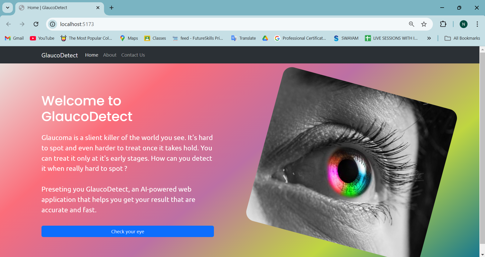

### About Page
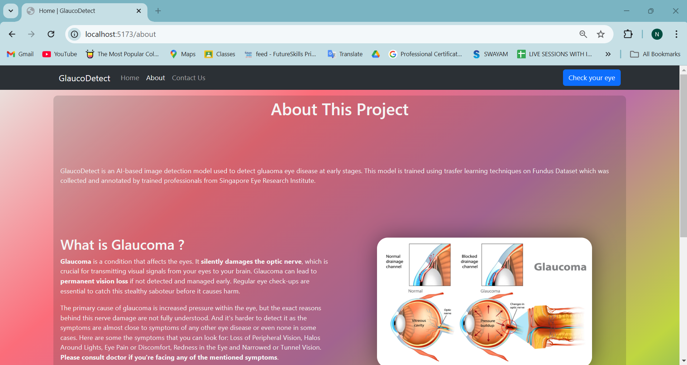

### Contact Us Page
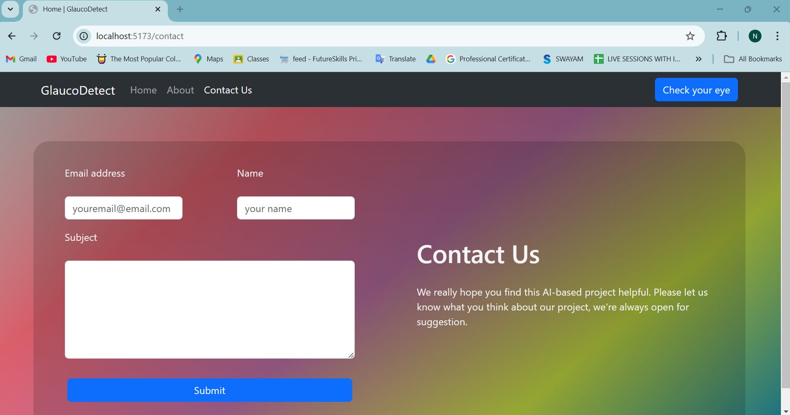

### Image Upload Interface
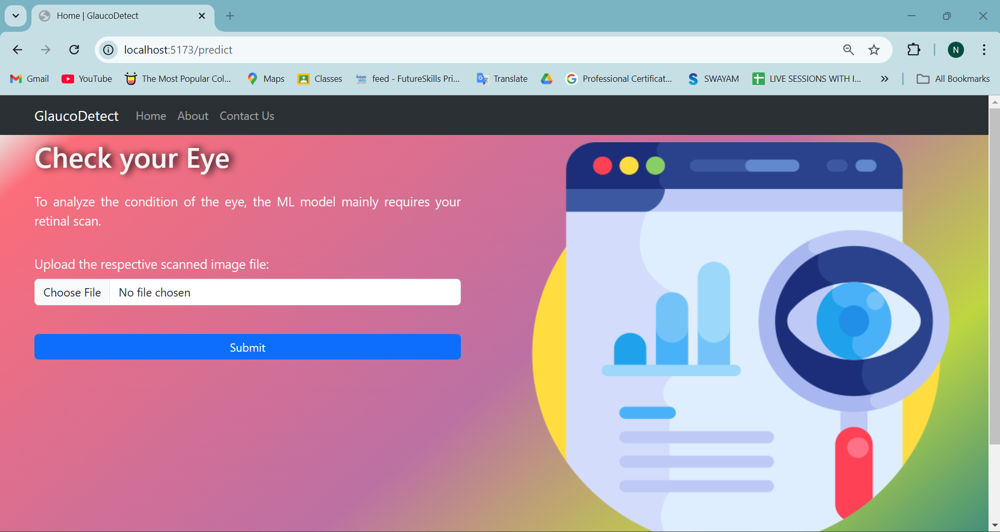

### Model Prediction and LIME Processing
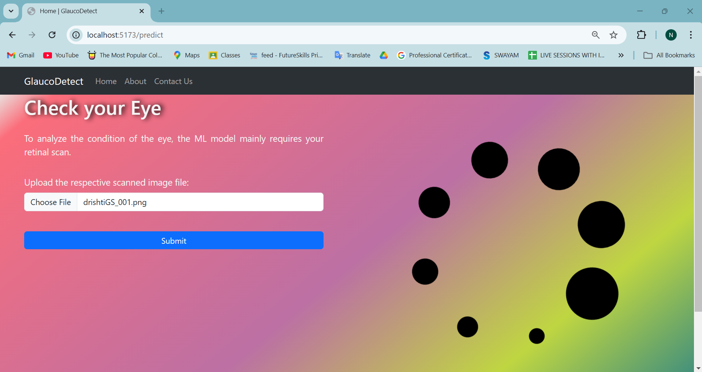

### Prediction Result
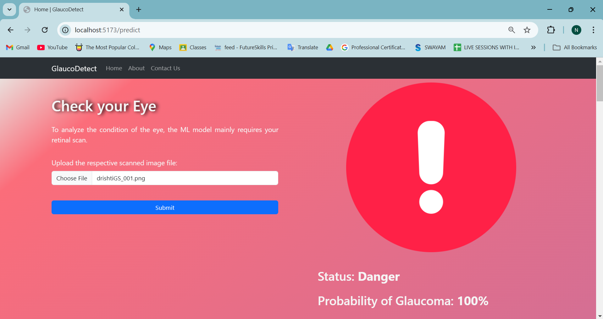

### LIME Explanation 1
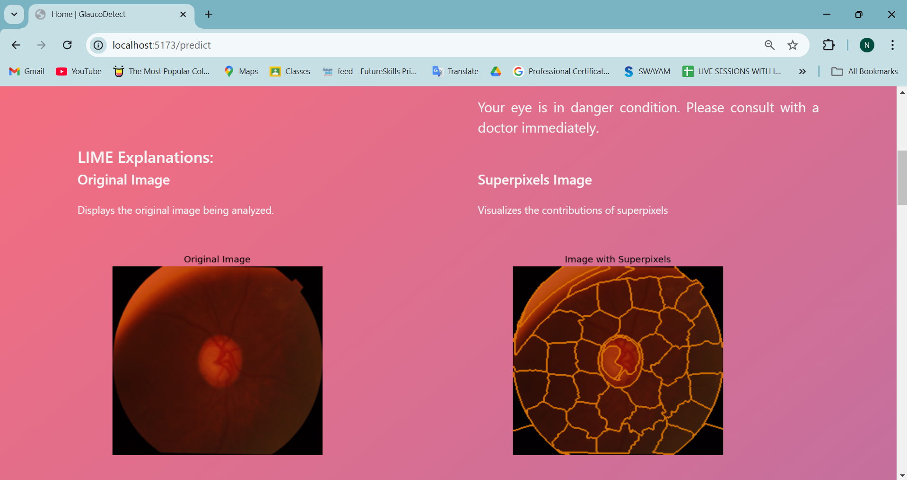

### LIME Explanation 2


### LIME Explanation 3
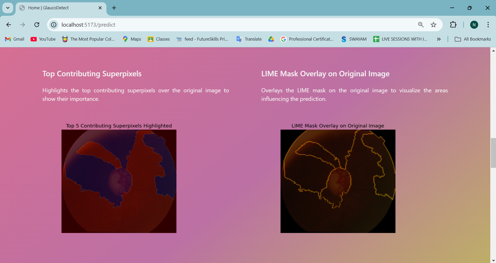

### LIME Explanation 4
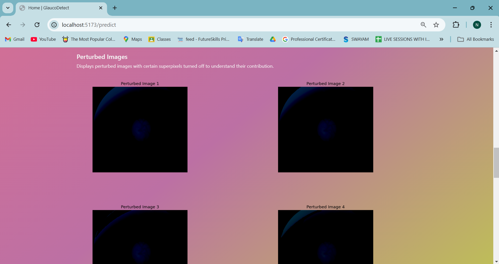

### LIME Explanation 5
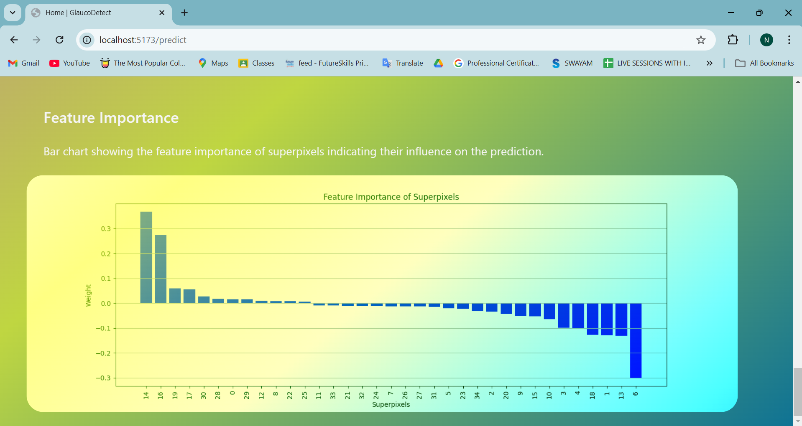

### Feedback Submission Page
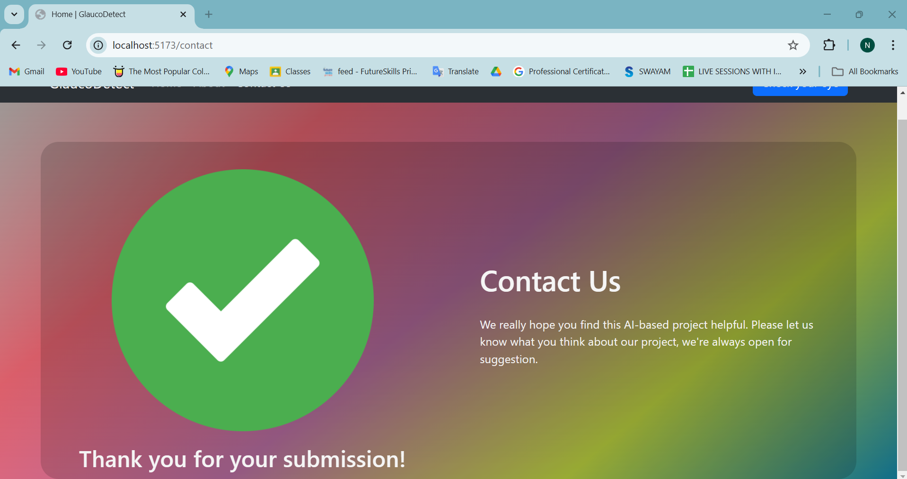

### MongoDB Database Store
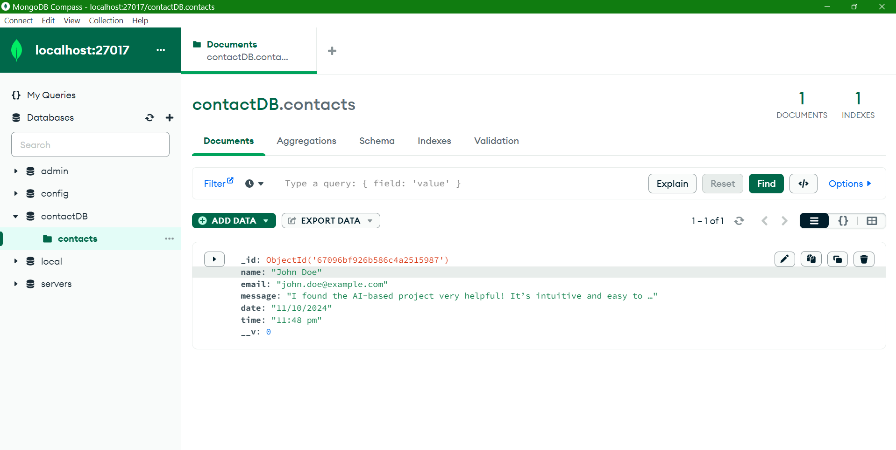
---
