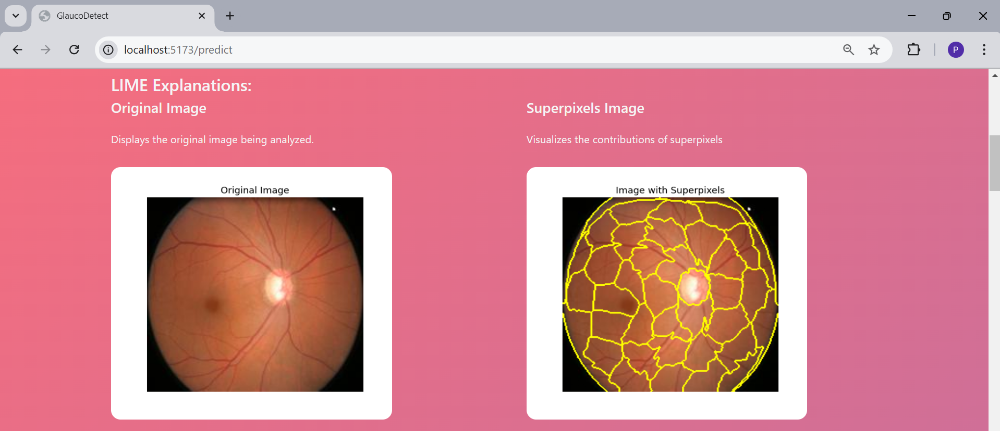
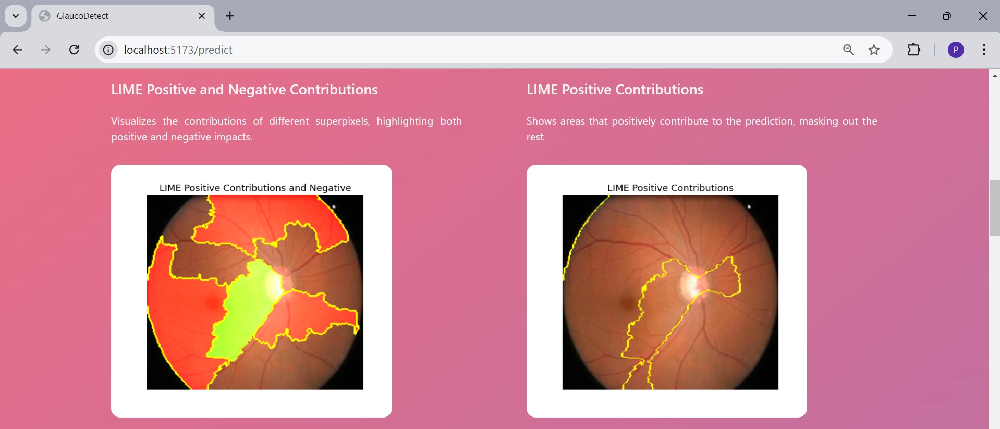
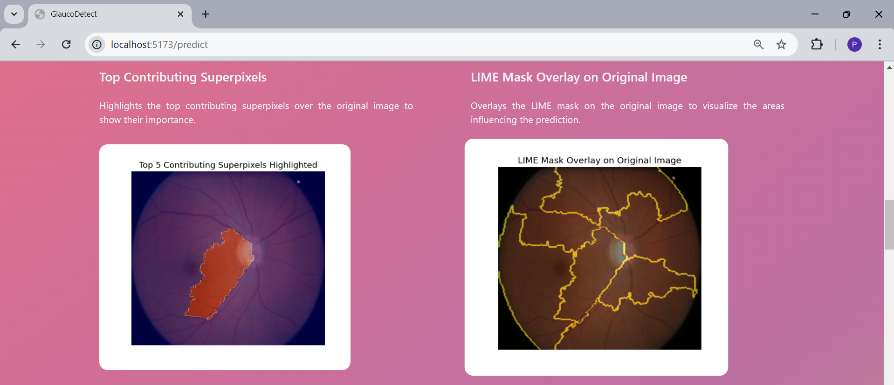
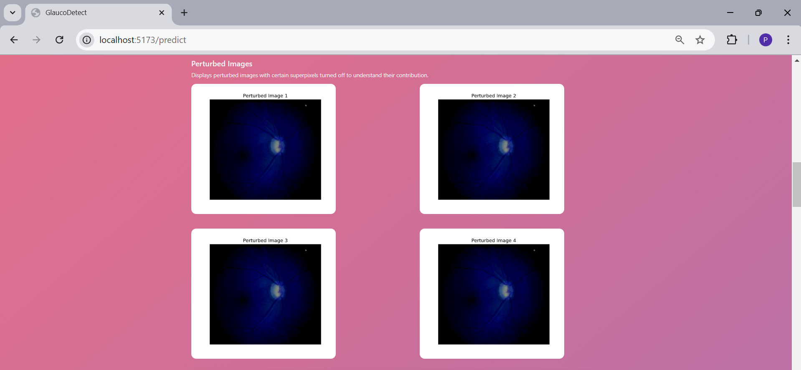
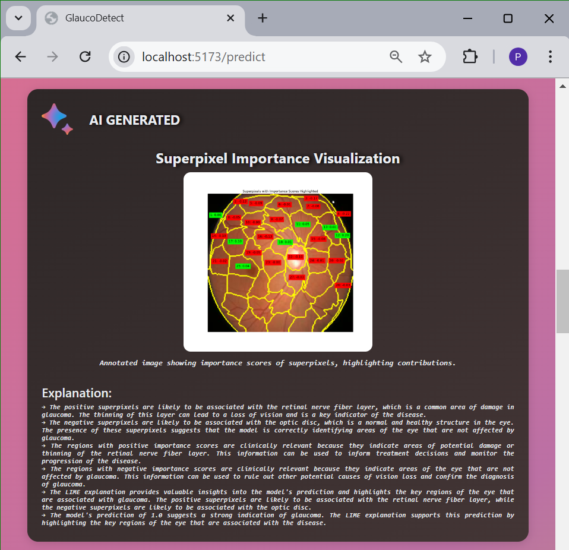

---

# Explainable AI-Based Glaucoma Detection using Transfer Learning, LIME and LLMs.

This project presents a **Multi-Modal Framework** for glaucoma classification, combining Transfer Learning, Explainable AI (XAI), and advanced large language models (LLMs). By integrating **LLAMA 3.2 90B Vision Model** for visual analysis and **LLAMA 3.1 70B LLM** for reasoning and textual explanation, this system enhances both prediction accuracy and interpretability.

---

## Table of Contents

- [Overview](#overview)
- [Framework Architecture](#framework-architecture)
- [Technologies](#technologies)
- [Project Structure](#project-structure)
- [Installation](#installation)
- [Usage](#usage)
- [Results and Visualizations](#results-and-visualizations)
- [Contributing](#contributing)
- [Snapshots](#snapshots)

---

## Overview

The system detects glaucoma from fundus images using Transfer Learning and integrates **LIME** to provide visual explanations for predictions. To further enhance interpretability, it employs:  
1. **LLAMA 3.2 90B Vision Model:** Analyzes LIME-based visual explanations to refine interpretability.  
2. **LLAMA 3.1 70B LLM:** Generates detailed textual reasoning, combining model outputs and vision insights.  

**System Components:**  
- **Frontend:** React.js-based interface for image upload and result visualization.  
- **Backend:** Express.js and FastAPI for handling predictions and hosting LLMs.  
- **Image Analysis:** Combines CNN-based classification with LIME and LLAMA models for interpretability.  
- **Database:** MongoDB stores user feedback to refine predictions.

---

## Framework Architecture

The workflow includes the following steps:  

1. **Image Upload:** Users upload fundus images for evaluation.  
2. **Classification:** A pre-trained CNN model classifies the images as **Normal** or **Glaucoma**.  
3. **LIME Explanation:** Highlights critical regions influencing the model’s decision.  
4. **Vision Model Analysis:**  
   - The **LLAMA 3.2 90B Vision Model** refines the explanation by analyzing LIME heatmaps and extracting superpixel importance.  
5. **Reasoning and Explanation:**  
   - The **LLAMA 3.1 70B LLM** generates a detailed textual explanation, synthesizing classification results and vision insights.  
6. **Feedback:** Users can submit feedback for continuous improvement.  

---

## Technologies

### Core Technologies:
- **Frontend:**  
  - **React.js** for an interactive user interface.  

- **Backend:**  
  - **Express.js** for RESTful APIs.  
  - **FastAPI** for serving machine learning models.  

- **AI Models:**  
  - **Transfer Learning:** Pre-trained CNN (e.g., VGG16) for glaucoma classification.  
  - **LIME:** For visualizing feature importance.  
  - **LLAMA 3.2 90B Vision Model:** Processes LIME-based visual explanations to refine interpretability.  
  - **LLAMA 3.1 70B LLM:** Produces natural language explanations based on model predictions and visual insights.  

- **Database:**  
  - **MongoDB** stores user feedback and metadata for continuous system improvement.

---

## Project Structure

Here’s how the project directories are organized:

```bash
Project/
│
├── Backend_Model/                    # Backend for the machine learning model and API
│   ├── model/                        # Model-related files
│   ├── Notebooks/                    # Model Training Notebooks
│   ├── predictenv/                   # Environment setup for model predictions
│   ├── server/                       # Fast API backend for model deployment
│   
│
├── Glaucoma-Detection-using-Transfer-Learning/  # Main application
│   ├── node_modules/                 # Node.js dependencies
│   ├── public/                       # Static files for frontend
│   ├── server/                       # Node.js and Express.js backend configuration
│   ├── server.js                     # Express.js API server entry point
│   ├── src/                          # React.js source code (frontend)
│   ├── .env                          # Environment variables for configuration
│   ├── package.json                  # NPM package configuration
│   ├── vite.config.js                # Vite configuration for frontend
│
├── Test Images/                      # Test images for model validation
│   ├── Glaucoma/                     # Images of glaucoma-affected eyes
│   └── Normal/                       # Images of normal eyes
│
├── .gitignore                        # Files to be ignored by git
└── README.md                         # Project documentation
```
---
## Installation

### Step 1: Clone the Repository

```bash
git clone https://github.com/Nehal04052/Explainable-AI-based-Glaucoma-Detection-using-Transfer-Learning-and-LIME.git
cd Explainable-AI-based-Glaucoma-Detection
```

### Step 2: Backend Setup

#### a. Set up the **FastAPI** server for model predictions:

Navigate to the directory with the Python model environment:
```bash
cd Backend_Model/predictenv
pip install -r requirements.txt
```

### Step 3: Frontend and express js Backend Setup

Navigate to the `Glaucoma-Detection-using-Transfer-Learning` directory and install the frontend dependencies:
```bash
cd ../../Glaucoma-Detection-using-Transfer-Learning
npm install
```

### Step 4: MongoDB Setup

- Install and start MongoDB locally, or configure a remote MongoDB instance.

### Step 5: Configure Environment Variables

Create a `.env` file in both `Backend_Model/server` and `Glaucoma-Detection-using-Transfer-Learning` directories. Here’s an example `.env` file for the Express.js backend:

```env
MONGO_URI=mongodb://localhost:27017/glaucomaDetection
PORT=5000
```

---

## Usage

### Step 1: Start MongoDB

Ensure MongoDB is running on your machine.

### Step 2: Start Backend Servers

#### a. Start the **Express.js** server:
```bash
cd ../../Glaucoma-Detection-using-Transfer-Learning
node server.js
```

#### b. Start the **FastAPI** server for model serving:
```bash
cd Backend_Model/server/
uvicorn main:app --reload
```

### Step 3: Start the Frontend

Start the React.js frontend:
```bash
cd ../../Glaucoma-Detection-using-Transfer-Learning
npm run dev
```

Once running, you can access the application in your browser at `http://localhost:3000`.

---

## Results and Visualizations

### Outputs:
1. **Classification Result:** Identifies the input image as **Normal** or **Glaucoma**.  
2. **LIME Heatmaps:** Highlights important regions in the fundus image.  
3. **LLAMA-Enhanced Explanation:**  
   - **Visual Analysis (LLAMA 3.2 90B):** Refines LIME outputs by identifying key superpixels and their relevance.  
   - **Reasoning (LLAMA 3.1 70B):** Provides detailed natural language explanations, offering clinical insights.  

### Example Workflow:
1. Upload a test image (e.g., from the `Test Images` folder).  
2. Receive the classification result and LIME-based visual heatmap.  
3. View detailed reasoning generated by the LLAMA models.  
4. Optionally submit feedback to improve the system.  

---


## Contributing

We welcome contributions! Follow these steps to contribute:

1. Fork the repository.
2. Create a new branch (`git checkout -b feature/YourFeature`).
3. Commit your changes (`git commit -m 'Add your feature'`).
4. Push to the branch (`git push origin feature/YourFeature`).
5. Open a Pull Request.

---

## Snapshots

Here are some snapshots of the system in action:

### Multi-Modal Framework for Glaucoma Classification and Explainable AI Integration


### Home Page


### About Page


### Contact Us Page


### Image Upload Interface


### Model Prediction and LIME Processing


### Prediction Result


### LIME Explanation 1


### LIME Explanation 2


### LIME Explanation 3


### LIME Explanation 4


### AI Generated Explaination


### Feedback Submission Page


### MongoDB Database Store

---
